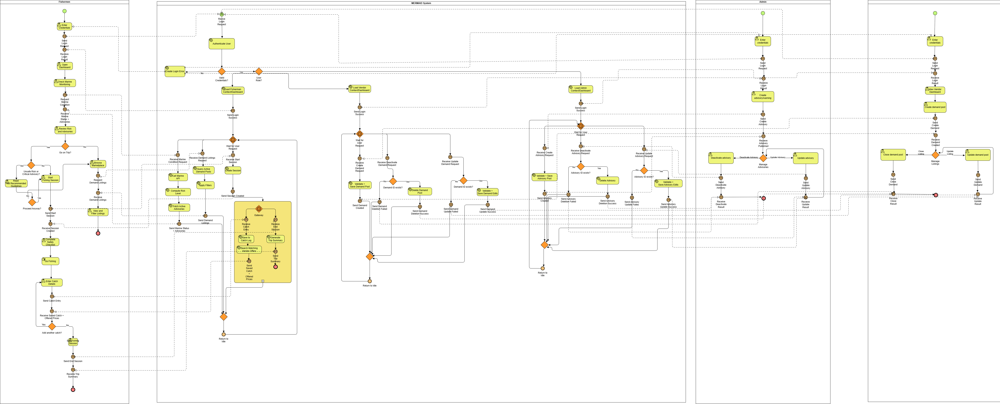
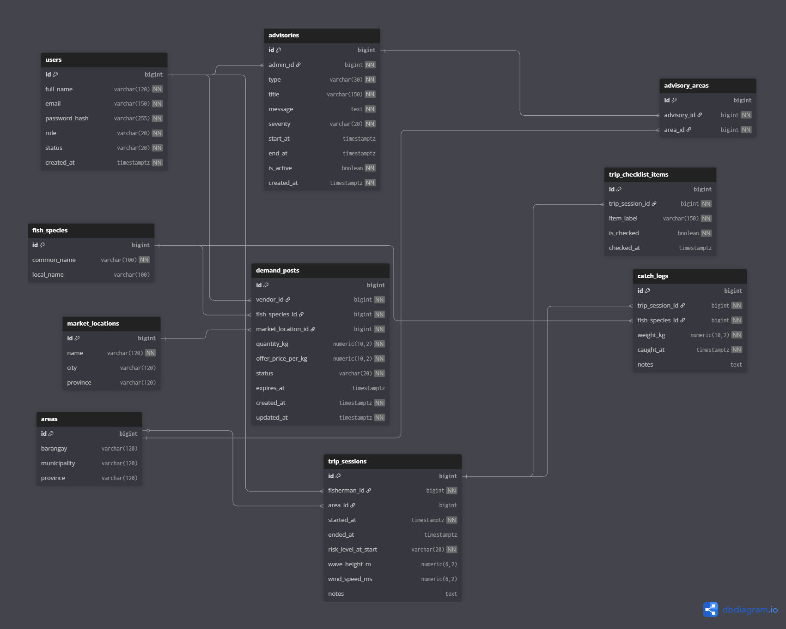

# Project Manifesto

## 1. Project Title & One-Liner

**Project Title:** MERMAID — Marine Early-warning, Risk Monitoring & Advisory Information for Demand

**One-Liner:** A web-based fisheries information system for small-scale fishermen and wet market vendors that supports safer trip decisions through marine risk information, managed warnings, and a vendor demand marketplace.

## 2. The Problem Statement

**For:** Small-scale fishermen in coastal communities and wet market vendors who buy fish directly from local landings

**Who wants to:** Reduce safety risks and uncertainty by giving fishermen timely sea-condition updates and official warnings for safer trips, while enabling vendors to post demand in advance so both sides can coordinate buying and selling more efficiently.

**Our project is a:** Web-based fisheries safety and market information platform

**That provides:** Marine condition risk indicators, admin-posted warnings/advisories, vendor-posted demand listings, and trip tools that guide safety checks and record catches—helping fishermen plan safer trips and helping vendors communicate demand more efficiently.

## 3. User Persona

### Persona 1: Isidro Domeng Domingo

- **Name:** Isidro Domeng Domingo
- **Role / Situation:** Small-scale fisherman who sells his catch to wet market vendors after landing
- **Goals (related to your project):**
  - Check marine conditions and risk level before going out
  - See vendor demand listings to decide where to sell
  - View official warnings that may affect safety (e.g., hazardous seas, red tide)
  - Use a trip session to complete safety checks and record catch entries during the trip
- **Frustrations (related to the problem you are solving):**
  - Sudden rough sea conditions that put him at risk
  - Not knowing demand information until he arrives at the market
  - Missing or delayed information about local hazards and warnings
  - No organized way to track catches per trip and review past trips

### Persona 2: Rosario "Saro" Mercado

- **Name:** Rosario "Saro" Mercado
- **Role / Situation:** Wet market vendor who buys fish directly from local landings and resells to regular customers and nearby eateries.
- **Goals (related to your project):**
  - Post demand listings in advance (fish type, quantity, offer price, market location)
  - Quickly update/close demand posts when supply is secured or prices change
  - See interested fishermen to coordinate expected arrivals
  - Monitor official advisories that may affect supply and adjust demand plans
- **Frustrations (related to the problem you are solving):**
  - Uncertain supply and late arrivals from fishermen
  - Sudden price changes that force last-minute updates
  - Missed transactions due to informal, scattered coordination
  - Disruptions from weather/warnings that make planning unpredictable

## 4. Feature Prioritization (The MoSCoW Method)

Be ruthless. Your "Must Have" list should be as small as possible.

### Must Have (MVP Launch-Critical)

- User Accounts & Roles (Fisherman/Vendor/Admin): login + role-based access control
- Admin Console: manage users, maintain reference data (fish species + market locations), and publish warnings/advisories (severity + affected areas)
- Vendor Demand Listings: create/update/close fish demand posts (species, quantity, offer price, market)
- Fisherman Marketplace View: browse demand posts with basic filters (species, location)
- Marine Conditions Dashboard: show forecast data + computed risk level
- Trip Session & Logs: start/end trip, complete safety checklist, and record catch entries tied to the trip

### Should Have (Important, but not for V1)

- Price reference module (typical price ranges per market/species)
- Demand notifications (alerts when new listings match fisherman filters)
- Summary dashboards (demand volume, trip counts)

### Could Have (Nice Additions for the Future)

- Advanced analytics: demand trends and top requested fish over time
- Trip enhancements: GPS tagging and richer trip summaries
- Offline-first logging: save trip/catch logs offline and sync later

### Won't Have (Explicitly Out of Scope)

- Online payments and checkout
- Delivery/logistics tracking
- Real-time bidding/auction
- Fish image recognition

## 5. Core User Flow

## 6. High-Level Data Schema

## 7. Proposed Tech Stack

- **Frontend:** React.js
- **Backend:** Java/Springboot
- **Database:** PostgreSQL
- **Deployment:**

## 8. MVP Milestone Tracker (6-Week Example)

Set a clear, primary goal for each week.

- **Week 1 Goal:** Project setup + DB schema + login/auth + role-based routing
- **Week 2 Goal:** Marine monitoring MVP — integrate marine/weather API, compute risk level (Safe/Caution/Unsafe), and build the fisherman dashboard view
- **Week 3 Goal:** Admin advisories — admin console + advisories CRUD (severity, affected areas, active dates) + advisories feed on fisherman dashboard
- **Week 4 Goal:** Vendor demand listings CRUD + vendor dashboard
- **Week 5 Goal:** Fisherman marketplace browsing + filters + connect catch logging price lookup to active vendor offers
- **Week 6 Goal:** Trip session + safety checklist + catch logs + Docker deployment + testing + demo data + documentation

## 9. Definition of Done

- Role-based authentication works for Fisherman, Vendor, and Admin with correct access restrictions
- Marine monitoring shows forecast data + computed risk level (Safe/Caution/Unsafe) for fishermen
- Admin advisories can be created/updated/deactivated with severity + affected areas, and are visible to fishermen
- Demand marketplace works end-to-end: vendors post/edit/close demand; fishermen browse with basic filters
- Trip sessions & catch logging work: start/end trip, safety checklist, and catch entries saved per trip with offer-price lookup when available
- App runs end-to-end in Docker Compose (Spring Boot + PostgreSQL) with demo data and is presentation-ready
