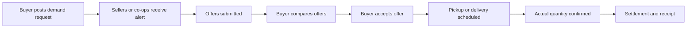
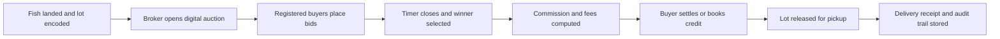

# Transaction Design for a Philippine Fisheries and Wet Market Marketplace

## Executive summary

Because the region is unspecified, the most reliable design baseline is not a single “Philippine fish market” pattern but a family of related patterns: large fish ports with brokered auctions, provincial landing sites with more direct trader buying, and public wet markets where fresh fish is still the default retail venue. Historical and recent sources point in the same direction. In larger ports, trading still clusters around night landings, rapid sorting, visual grading, and broker-led auctions or negotiated sales; in smaller or less formal channels, direct deals between fishers, traders, retailers, and consumers remain common. Public markets continue to dominate fresh-fish buying because many buyers prioritize price, accessibility, and seller relationships over formal retail environments. citeturn10view2turn26view0turn34view1turn39view0turn40view0

Payment and settlement are also hybrid. Cash remains the default in many wet-market and landing-site transactions, but wholesale trade often runs on credit, delayed settlement, and informal advances; some ports historically reported wholesale trade as overwhelmingly credit-based, while more recent work still finds payment problems and information asymmetry at the broker level. At the same time, digital payments have become normal enough that they cannot be ignored: the entity["organization","Bangko Sentral ng Pilipinas","philippines central bank"] reported that digital retail payments reached 57.4% of total transaction volume in 2024, but business-to-business payments still lag household and government flows. Wet-market adoption studies from the entity["organization","University of the Philippines Los Baños","laguna campus ph"] found that buyers are generally more willing than sellers to use mobile payments; seller-side barriers include fear of scams, lack of knowledge, and low technology confidence. citeturn5view0turn10view1turn10view0turn24view0turn24view1turn15view4

The strongest product implication is that a mobile app should **not** start as a pure disintermediated consumer marketplace. The safest MVP is a hybrid: a cooperative- or encoder-assisted inventory model for supply creation, a buyer-order board for next-day demand, and an optional broker-mediated auction mode where brokered trading already dominates. That recommendation is an inference from the evidence: brokers still provide finance, aggregation, and price discovery; relationships and reputation are still central to trust; food-safety and traceability documentation are uneven across real landing sites; and sellers’ digital readiness is materially lower than buyers’. citeturn22view0turn33view0turn34view0turn39view0turn40view0turn24view0turn24view1

A practical Philippine-ready app should therefore support five things from day one: configurable selling units such as kilogram, piece, lot, and bañera; multiple pricing modes including fixed, negotiable, sealed-bid, and consignment reconciliation; hybrid settlement including cash, QR/e-wallet, bank transfer, COD, and ledger credit; low-text, photo-first, call-and-chat-first UX; and role-based compliance fields rather than a one-size-fits-all documentation burden. citeturn26view0turn40view0turn25view0turn30search0turn30search11turn45search2

## How transactions work today

The institutional backbone is the entity["organization","Department of Agriculture","philippines agriculture agency"], the entity["organization","Bureau of Fisheries and Aquatic Resources","philippines fisheries regulator"], the entity["organization","Philippine Fisheries Development Authority","philippines fish port authority"], local governments, and—on the payments side—the BSP together with the entity["organization","Department of the Interior and Local Government","philippines interior agency"]. At the producer end, BFAR’s FishR and BoatR programs formalize parts of the municipal fisheries base by registering municipal fisherfolk, fishworkers, and municipal fishing boats/gears. At the market end, local governments remain responsible for food safety and sanitation in wet markets and other food businesses in their jurisdictions, while BFAR handles transport and fish health documentation for regulated domestic movements. citeturn52search0turn52search1turn43view1turn30search0turn30search11turn45search2

image_group{"layout":"carousel","aspect_ratio":"16:9","query":["Navotas Fish Port Complex auction hall Philippines","Philippines wet market fish stall public market","Philippines fish landing site municipal fisherfolk","Philippines fish vendor ice public market Philippines"],"num_per_query":1}

In major wholesale settings such as entity["point_of_interest","Navotas Fish Port Complex","navotas, metro manila, ph"], fish commonly arrives at night, is unloaded in standardized containers such as bañeras, sorted and visually graded, and then traded through brokers or auctioneers. A 2024 thesis on Navotas documented three core hall operations—unloading, grading, and trading—and found that fish was still sold both per bañera and per kilo, with local grade labels such as **primera**, **segunda**, and **tersera** assigned by visual inspection. Older but consistent port studies describe essentially the same operating logic: cargo arrives in the evening, bids are taken after midnight, and fish moves into retail channels before heat and spoilage rise. citeturn40view0turn10view2turn26view0

A useful actor map for app design is below. It is a synthesis of port studies, wet-market studies, BFAR/CDA material, and fish-trade literature rather than a claim that every locality has all actors in the same proportions. citeturn10view0turn10view1turn22view0turn34view1turn40view0

| Actor | Typical role in today’s chain | Main leverage point | Main friction for a digital product |
|---|---|---|---|
| Fishermen and fish farmers | Land or harvest fish; may sell on landing, through a broker, to a trader, or through a cooperative | Freshness, timing, species mix, local relationships | Low time for data entry; uneven documentation; urgent need for cash |
| Brokers / auctioneers / commission agents | Match supply and buyers, run bidding, extend influence through finance and market access | Price discovery, buyer network, speed, credit intermediation | May resist transparency if the app removes opaque margins |
| Wholesalers / trader-buyers | Buy in bulk, break lots, move fish to markets, processors, or retailers | Working capital, trucks, market reach | Need fast ordering, reliable supply, and flexible settlement |
| Wet-market vendors / retailers | Sell to final consumers in stalls or via mobile vending | Customer trust, freshness display, neighborhood access | Prefer very simple UX; often still cash-led |
| Mobile vendors / peddlers | Door-to-door or ambulant sale, especially where no central market is nearby | Convenience and access | Need replenishment and small-lot procurement |
| Consumers / restaurants / institutions | Buy by price, freshness, trust, convenience, and accessibility | Demand visibility and repeat orders | Need confidence in species, grade, weight, and delivery window |
| Cooperatives / associations | Pool, grade, market, transport, and sometimes finance members’ catch | Aggregation, compliance, bargaining power | Governance and working-capital weaknesses can slow payouts |
| Port and market labor | Unload, drag bañeras, sort, weigh, clean, move lots | Operational throughput | Need assisted, icon-led, very low-text tools |
| LGUs / BFAR / PFDA | Sanitation, permits, fish-port operations, transport and health documents | Legitimacy, inspection, onboarding channels | Rules vary by place; compliance must be configurable |

Sales channels in practice are more diverse than a simple “fisherman to consumer” story. At one end are direct sales at landing sites and short direct channels from producers to traders or retailers. At the other end are broker-led auctions in large ports, especially for high-volume landings. Between those poles are wholesaler-retailer hybrids, periodic wet markets, ambulant vending, and consignment-like arrangements where a broker or buyer advances funds, moves product, and settles later. FAO and PIDS materials describe four enduring intermediary types—brokers, wholesalers, wholesaler-retailers, and retailers—while recent fieldwork still finds that many operational frictions sit exactly at the broker and grading layers. citeturn34view1turn10view0turn33view0turn40view0

Pricing is not uniform. In large port settings, fish may be sold by whispered bidding (**bulungan**), by open oral bidding in some provincial markets, or by fixed/negotiated price in direct trader deals. Units also differ by channel: some lots move by kilo, others by piece, tray, lot, or bañera. Quality is often assessed visually rather than instrumentally; the Navotas thesis found grade assignment based on visual inspection, and BFAR’s own price-monitoring pages note prevailing retail prices by commodity while monthly reports and search snippets repeatedly reference size and quality as price determinants. Older Manila-area descriptions likewise note that fish can be sold by bañera, tray, lot, or piece depending on species and market. citeturn40view0turn51search0turn51search1turn28search6turn28search18turn26view0

Settlement is structurally hybrid. In one SEAFDEC account from Iloilo, brokers bought in cash from suppliers but sold onward to wholesale buyers using a largely credit-based system, with a market supervisor estimating that around 98% of wholesale fish trade was credit-based there; the 2000 PIDS review similarly observed that brokers’ market influence came partly from paying suppliers on behalf of wholesaler-buyers who took fish on consignment. A more recent study of whisper-bid auctions in Dalahican found persistent payment and standardization problems and concluded that price information was not equally available to all participants. This mix of cash-at-source, credit-to-buyer, and delayed reconciliation is exactly why Philippine market software needs both wallets and ledgers. citeturn10view1turn10view0turn33view0

Logistics are equally time-sensitive. Fish may land from around evening onward, be auctioned after midnight, and reach retail markets by early morning. Packaging can include banyeras, wooden trays, layered crushed ice in boxes, woven plastic bags, kaing baskets, and live-fish trucks with tanks and aeration systems. Older and newer studies converge on a core fact: preservation still depends heavily on ice and quick movement. The Navotas 2024 assessment also noted that many regional fish ports still lack fully functional cold storage, that melted ice is not always replaced properly, and that unclean bañeras and floors create contamination risk. An NFRDI study on postharvest losses due to market supply-demand changes estimated losses of 3.98% at capture-commodity landing sites and 0.44% in wet markets in the assessed sites, which reinforces the importance of pre-selling and better dispatch timing. citeturn26view0turn10view1turn10view2turn11view1turn40view0turn12search0

Trust is still highly relational. A SEAFDEC article on middlemen emphasized **honesty**, **capital capability**, **credibility**, **good reputation**, and **pakikisama** as valued traits in fish-trade intermediaries. A fresh-fish market-choice study found that buyers favored markets where sellers promoted good relationships, prices were reasonable, and the market was accessible and clean. Those findings matter for UX: a marketplace should not rely on abstract platform trust alone. It needs visible counterparty history, photos, repeat-trade signals, and easy contact options. citeturn34view0turn39view0

Cultural and behavioral realities also directly shape product design. The entity["organization","Philippine Statistics Authority","philippines statistics office"] reported in 2025 that 67.3% of individuals aged 10+ used the internet in 2024; among internet users, 98.8% used a cellphone, 94.2% used the internet for making calls, and 87.3% used it for social networks. But the same agency also reported that only 70.8% of Filipinos aged 10–64 were functionally literate in 2024, which means low-text, icon-led, voice-friendly UX is not optional. Cost is another real constraint: PSA found that the most common barrier to no home internet and non-use of internet was the high cost of subscription, while UPLB wet-market payment studies found seller awareness and trust lagging behind buyers. citeturn25view0turn25view1turn24view0turn24view1

Regulatory and compliance obligations sit across several layers. Under the Food Safety Act, LGUs are responsible for food safety in activities and establishments such as fish ports, wet markets, supermarkets, and ambulant vending within their jurisdictions, and they enforce sanitary rules under PD 856. PD 856 itself requires food establishments to secure a permit from the local health office. DILG’s business-permit manual shows the standard LGU flow around the mayor’s/business permit, barangay clearance, and related regulatory clearances including sanitary and fire clearances. BFAR’s certification pages and citizen-charter search snippets also show that Local Transport Permits and Domestic Health Certificates are part of the domestic movement toolkit for fish and fishery products, while a 2025 BFAR order lays down specific hygiene rules for primary and post-harvest fishery business operators. citeturn43view1turn45search2turn46view0turn30search0turn30search1turn30search2turn30search11turn14search3

Existing local digital patterns are already visible, but they are not all the same kind of platform. Some are operating government or private channels; others are pilots or prototypes worth watching rather than copying wholesale.

| Existing local example | What it shows | Design lesson |
|---|---|---|
| The government’s entity["organization","KADIWA","da market program"] and regional online KADIWA variants | DA’s supplier lists include fisherfolk cooperatives, and DA Region X’s online KADIWA launched as a digital expansion of a regular on-site market with scheduled delivery windows to consumers. eKadiwa reporting also showed payment methods such as COD and bank transfer. citeturn18view2turn18view4turn27search9turn27search24 | Scheduled, curated supply with accredited sellers is easier to operationalize than a chaotic open marketplace. |
| entity["company","Mayani","agritech philippines"] | Mayani positions itself as an agri-fisheries platform connecting smallholder farmers and fisherfolk to markets, inputs, and credit, with both household and B2B buyer pathways. citeturn50view0turn50view1turn50view2 | A successful marketplace in this sector often has to be more than “listings”: it becomes market access + finance + fulfillment. |
| Paleng-QR Ph Plus | BSP and DILG’s program is explicitly about getting public-market vendors and similar merchants to accept QR-based digital payments, with LGU-led onboarding and account-opening days. As of 31 March 2026, BSP said 1,120 LGUs had been enjoined or were participating. citeturn15view4 | Payment adoption is most likely when the app rides existing QR/account programs instead of inventing a parallel payment rail. |
| WWF-backed Tracey white paper | Tracey is a traceability-and-trade data concept for fisherfolk and buyers, designed to share verified catch data with regulators and buyers and potentially improve access to finance. citeturn31view0 | Verified traceability can become a premium feature later, but mainstream wet-market MVPs should start lighter. |
| FishNet and Juan Catch pilots | entity["organization","Mindoro State University","oriental mindoro ph"]’s FishNet prototype focuses on catch visibility and GPS-linked transactions; Juan Catch was designed to connect small-scale fishers directly with larger seafood buyers while coordinating financing and logistics. citeturn31view2turn37view0 | The market already sees “real-time catch visibility + financing + logistics” as the right problem frame. |

## Recommended transaction models

The four models below are the most defensible starting set because each maps onto a transaction pattern already observed in the Philippines: direct producer-to-buyer trade, demand-led replenishment, brokered auction, and cooperative-managed aggregation. The comparison table is a design synthesis from the market evidence above, not a report of an existing single platform. citeturn18view4turn50view2turn33view0turn22view0turn39view0turn40view0

| Model | Best context | Dominant price mode | Dominant risk holder | Best first use |
|---|---|---|---|---|
| Seller-posts listing | Short-chain landings, curated direct selling, same-day catch | Fixed, negotiable, reserve | Seller until acceptance | Fisher/co-op to vendor or small retailer |
| Buyer-orders | Dense wet-market and restaurant demand, next-day planning | Buyer target price + seller offers | Buyer on forecast; seller on fulfillment | Morning replenishment and route planning |
| Broker-mediated auction | Large fish ports with existing bulungan culture | Sealed or timed bid, broker fee visible | Broker + buyer settlement layer | Port digitization without displacing brokers |
| Cooperative-managed pool | Low digital readiness, clustered fisherfolk, government/co-op anchor | Fixed, negotiated, contract, consignment | Co-op as merchant of record | Strongest MVP for pilot control |

**Seller-posts listing**

This model digitizes channels where sellers can expose catch or harvest lots directly to wet-market vendors, retailers, processors, or households. It is closest to what direct producer-to-trader selling and KADIWA/Mayani-style curated selling already do. It works best when supply is posted by an assisted encoder, cooperative staff member, or literate household member rather than assuming the fisher personally enters every field on the beach. Its biggest advantage is transparency and pre-selling; its biggest weakness is that it can break down if actual landed weight and quality diverge from the listing. citeturn34view1turn18view4turn50view2turn39view0turn40view0

Recommended UX flow:

1. Seller or assisted encoder creates a catch lot.
2. The app captures species, local name, estimated quantity, unit type, freshness state, photos, grade, landing time, and pickup/delivery window.
3. The app suggests a reference price band using BFAR market-price data and the last local settlement prices.
4. Buyer browses or filters by species, grade, location, and arrival time.
5. Buyer taps **Reserve**, **Counteroffer**, or **Call Seller**.
6. Handoff screen records actual weight, photo recheck, and any grade changes.
7. Final invoice is recalculated, and payment occurs by cash, QR, bank transfer, COD, or ledger credit.
8. Both sides confirm completion and rate the transaction.

| Required data fields | Payment and settlement flow |
|---|---|
| `seller_id`, `seller_type`, `landing_site`, `species_code`, `local_name`, `unit_type_original`, `unit_type_normalized`, `estimated_qty`, `freshness_state`, `grade_local`, `grade_standard`, `photos`, `available_from`, `available_until`, `pricing_mode`, `asking_price`, `pickup_or_delivery`, `payment_modes_supported` | Use **actual landed/reweighed quantity** as the settlement base. For new counterparties, require either same-day cash/QR settlement or a small reservation deposit. For trusted vendor relationships, allow end-of-day reconciliation. Support a **consignment flag** for stall replenishment: quantity issued, quantity sold, markdowns, returns, and net payable. |

**Buyer-orders**

This model reverses the marketplace. Instead of asking fragmented sellers to post supply first, it lets wet-market vendors, restaurants, and retailers post what they need for the next morning or next trading window. That better fits contexts where buyers already know the species, size, and volume they want, and where they care more about dependable replenishment than browsing supply. It also helps because buyers choose markets partly on accessibility, transportation cost, and seller relationships; in other words, demand planning matters as much as broad catalog visibility. citeturn39view0turn18view4turn50view2

Recommended UX flow:

1. Buyer creates a **Buy Request**.
2. Buyer specifies species, substitute species, grade/size, quantity, deadline, delivery window, and payment terms.
3. Fishers, traders, or co-ops receive the request and submit offers.
4. Buyer compares offers on price, freshness timing, and trust score.
5. Buyer accepts one offer or splits the order across two or more sellers.
6. The app consolidates pickup/delivery routing.
7. Handoff confirmation captures actual quantity and discrepancies.
8. Order closes with settlement and feedback.

| Required data fields | Payment and settlement flow |
|---|---|
| `buyer_id`, `market_or_store_location`, `species_requested`, `acceptable_substitutes`, `target_grade`, `min_qty`, `max_qty`, `delivery_deadline`, `delivery_window`, `target_price_or_budget`, `packaging_need`, `payment_terms_requested`, `fulfillment_priority` | Good for **PO-like flows**. Allow a small advance for rare or perishable custom orders, but keep COD and QR-at-delivery available for ordinary stall replenishment. Add cancellation rules because fish is highly perishable. |

**Broker-mediated auction**

This model is the least disruptive way to digitize large landing sites without pretending the broker layer does not exist. It is the right model where bulungan, broker-controlled hall space, and high-throughput lot movement are already normal. The app should not start by trying to “eliminate” brokers in these settings. It should instead force more transparent event records: lot creation, bid window, winning bid, commission, settlement status, and product movement. That directly responds to evidence from Dalahican and older market studies that broker-level price information is opaque and that hidden margins or underpricing incentives can emerge in whisper-bid environments. citeturn33view0turn10view0turn10view1turn26view0turn40view0

Recommended UX flow:

1. Port encoder or broker creates auction lots as fish is landed.
2. Each lot receives a lot number, species, unit, estimated or actual quantity, visible photos, and grade.
3. Registered buyers receive the lot feed in real time.
4. Buyers submit a sealed digital bid, a timed bid, or an assisted offline bid entered by the broker clerk.
5. The auction closes automatically.
6. Winning bidder and final price are displayed to authorized parties.
7. Broker commission and labor fees are shown as separate lines.
8. Buyer settles by cash confirmation, QR, transfer, or credit-ledger entry.
9. Lot release, truck loading, and buyer receipt are recorded.

| Required data fields | Payment and settlement flow |
|---|---|
| `auction_id`, `broker_id`, `seller_id`, `lot_number`, `species_code`, `unit_type`, `estimated_or_actual_qty`, `grade_local`, `photo_set`, `reserve_price_optional`, `bid_type`, `bid_open`, `bid_close`, `winning_bid`, `commission_rate`, `labor_fee`, `settlement_status`, `release_status` | Make the broker commission **explicit and configurable**. Older sources reported around 5–6% in some markets, but the software should never hard-code a single national rate. Preserve cash and credit modes, because brokers often mediate both supplier payment and buyer collection. |

**Cooperative-managed pool**

This is the strongest pilot model if you can only start with one. It fits the evidence best where digital literacy is uneven, trust is relationship-based, and the real pain point is not listing creation but **aggregation, grading, logistics, and payout transparency**. It also aligns with policy direction from the entity["organization","Cooperative Development Authority","philippines cooperative agency"] and BFAR, which explicitly frame cooperatives as a way to counter middlemen-led dependence and strengthen collective marketing. BFAR supplier lists under KADIWA already include fisherfolk cooperatives, and private platforms like Mayani also show that market-access systems in the Philippines often work best when there is an organized supply-side node rather than atomized individuals. citeturn22view0turn18view2turn50view2turn52search0turn52search1

Recommended UX flow:

1. Fishers deliver catch to a cooperative receiving point or landing-point buying station.
2. Co-op staff accepts, grades, weighs, photographs, and pools inventory.
3. The pool is posted into the app as immediately available supply or next-day inventory.
4. Buyers place orders or standing replenishment requests.
5. The co-op allocates lots to buyers, plans dispatch, and issues delivery notes.
6. Delivery/handoff records actual quantity, grade adjustments, and buyer acceptance.
7. Payment goes to the co-op as merchant of record.
8. The app automatically computes member payouts after co-op fees, transport, ice, packaging, and loan deductions.

| Required data fields | Payment and settlement flow |
|---|---|
| `member_id`, `member_verification_refs`, `source_vessel_or_farm`, `delivery_timestamp`, `gross_weight`, `accepted_weight`, `grade_local`, `grade_standard`, `pooled_inventory_id`, `buyer_order_id`, `deduction_schedule`, `member_loan_balance`, `net_payout`, `payout_method` | Best for **daily or batch payout**. Use ledger transparency aggressively: gross sales, co-op service fee, ice, transport, packing, advances, and net receivable should all be visible in one member statement. This model makes credit safer because the co-op, not the individual fisher, is the settlement counterparty. |

The best rollout order is usually **co-op managed pool first**, **buyer-orders second**, **seller-posts listing third**, and **broker-mediated auction last** unless the pilot site is already a broker-dominant fish port. That sequence reduces operational chaos while still preserving a path toward more open price discovery later. citeturn22view0turn24view1turn33view0turn40view0

## UX wireframes and API data schema

The strongest UX pattern for this market is **photo-first, unit-aware, bilingual, and assisted**. The evidence is clear enough to justify that direction: cellphone use dominates among internet users; making calls and social-network activity are more common than more formal digital tasks; functional literacy is materially lower than basic literacy; and wet-market sellers lag buyers in digital-payment readiness. That means the product should look less like a complex B2B ERP screen and more like a transaction board that can be used by a market clerk, cooperative encoder, or vendor with minimal typing. citeturn25view0turn25view1turn24view0turn24view1

Sample wireframe elements:

| Screen | Must-have UI elements | Why it matters in this context |
|---|---|---|
| Home / Today’s Catch Board | Species chips, local fish names, large photo, freshness badge, grade badge, landing time, unit badge (`kg`, `piece`, `lot`, `bañera`), price mode, payment badges, **Call/Chat** CTA | Supports browsing under time pressure and low-text use; matches phone-call and chat behavior. |
| Buy Request Composer | Species selector, acceptable substitutes, target grade, quantity, deadline, location pin, delivery/pickup selector, payment terms | Crucial for buyer-order flows and morning replenishment planning. |
| Auction Room | Lot number, broker name, bid timer, current state, fee line, quantity and grade, fast bid buttons, clerk-entry mode | Lets ports digitize without removing the broker workflow. |
| Handoff / Reweigh Screen | Scale entry, photo capture, discrepancy alert, grade override, acceptance / dispute buttons | Fish listings often need revalidation at pickup or delivery. |
| Payout and Ledger | Gross sales, deductions, advances, overdue credit, payout status, payout channel, downloadable receipt | Essential where cash, credit, and deductions coexist. |
| Trust Panel | Seller history, completed trades, on-time score, dispute rate, quality complaint rate, verification badges | Relationship and reputation are central to trade decisions. |
| Compliance Panel | Permit status, sanitary-clearance reminder, transport-doc upload, FishR/BoatR ref, stall/market permit notes, expiry warnings | Compliance varies by actor and locality; the app must track what exists without blocking all trade. |

A simple “today’s catch” card should visually show the information that offline buyers usually ask first: **what species, how fresh, how much, what unit, what grade, where, when, how to pay, and who is selling**. It should also show both the original market term and the normalized system term—for example, `1 bañera ≈ 38 kg actual confirmed`—because Philippine trade units are not always identical across sites. That recommendation is grounded in observed use of trays, bañeras, per-kilo sales, and local visual grading in major ports. citeturn26view0turn40view0

Suggested canonical API/data schema:

| Object | Minimum fields | Design notes |
|---|---|---|
| `actor` | `actor_id`, `actor_type`, `name_display`, `mobile_no`, `preferred_language`, `role_capabilities`, `home_market_or_landing_site` | Use role flags: fisher, broker, trader, vendor, buyer, cooperative staff, driver, inspector. |
| `seller_profile` | `seller_id`, `verification_level`, `cooperative_id_optional`, `fishr_ref_optional`, `boatr_ref_optional`, `payment_modes`, `reputation_summary` | FishR/BoatR should be optional but structured. |
| `catch_lot` | `lot_id`, `source_type`, `species_code`, `local_name`, `harvest_or_landing_time`, `unit_type_original`, `unit_type_normalized`, `estimated_qty`, `freshness_state`, `grade_local`, `grade_standard`, `photo_urls[]` | Keep both local and normalized units, and both local and standardized grades. |
| `listing` | `listing_id`, `lot_id`, `pricing_mode`, `asking_price`, `min_order_qty`, `reserve_price_optional`, `available_window`, `pickup_or_delivery`, `consignment_allowed` | `pricing_mode` enum should include `fixed`, `negotiable`, `sealed_bid`, `open_bid`, `consignment`, `contract`. |
| `buy_request` | `request_id`, `buyer_id`, `species_requested`, `substitutes[]`, `target_grade`, `qty_needed`, `need_by`, `delivery_window`, `price_target_optional`, `payment_terms` | This object is the heart of buyer-order flows. |
| `bid` | `bid_id`, `auction_id`, `bidder_id`, `bid_amount`, `timestamp`, `bid_mode`, `status` | Allow assisted-entry bids for brokers/clerks handling offline whispers. |
| `order` | `order_id`, `source_listing_or_request`, `buyer_id`, `seller_or_coop_id`, `ordered_qty`, `agreed_price`, `dispatch_mode`, `expected_handoff_time`, `status` | Keep order and auction settlement separate but interoperable. |
| `handoff_inspection` | `handoff_id`, `order_id`, `actual_qty`, `grade_confirmed`, `temperature_optional`, `photos[]`, `discrepancy_reason`, `accepted_by` | Necessary to settle frequent quantity/grade disputes. |
| `payment` | `payment_id`, `order_id`, `payer_id`, `payee_id`, `method`, `amount`, `proof_ref`, `status`, `paid_at` | `method` enum: `cash`, `qr_ph`, `wallet`, `bank_transfer`, `cod`, `credit_ledger`, `mixed`. |
| `settlement_ledger` | `ledger_id`, `actor_id`, `gross_sales`, `fees`, `ice_cost`, `transport_cost`, `loan_deduction`, `net_payable`, `due_date`, `settlement_status` | This is where co-op and broker workflows become manageable. |
| `compliance_document` | `doc_id`, `actor_id`, `doc_type`, `issuer`, `doc_number`, `issue_date`, `expiry_date`, `file_url`, `verification_status` | Use `doc_type` values such as `business_permit`, `barangay_clearance`, `sanitary_permit`, `ltp`, `domestic_health_certificate`, `market_stall_clearance`. |
| `reputation_event` | `event_id`, `actor_id`, `counterparty_id`, `event_type`, `score`, `notes`, `linked_order_id` | Do not rely only on star ratings; include real operational signals such as no-show, discrepancy, or late payout. |

Two architecture choices are especially important. First, the app should be **offline-first or low-connectivity tolerant**, with queue-and-sync behavior for listing creation, handoff confirmation, and auction clerk entry, because network cost and connectivity remain barriers. Second, the app should separate **catalog truth** from **settlement truth**: listings can hold estimated quantity, but payouts and invoices must be based on confirmed handoff data. citeturn25view0turn24view1turn40view0

## Risks and adoption

The hardest risks in this market are not purely technical. They are institutional, behavioral, and financial. Price opacity, quality disputes, cash dependency, and entrenched intermediary roles have been documented for decades, and recent studies show they are still relevant enough to shape product design today. Wet-market digital adoption is improving, but fear of scams and low seller confidence remain real. A viable rollout therefore needs both product controls and field operations. citeturn10view0turn33view0turn24view0turn24view1turn22view0

| Risk | Why it matters in Philippine fish trade | Mitigation |
|---|---|---|
| Broker resistance | Brokers may see transparency as margin erosion | Position broker mode as a workflow upgrade, not a removal tool; surface commissions explicitly but let brokers remain the event operator. |
| Weight and grade disputes | Fish is often listed before reweighing or final grading | Require handoff confirmation with photos and actual weight; allow discrepancy thresholds and dispute codes. |
| Cash leakage / unrecorded side deals | Many counterparties still prefer off-platform settlement | Allow cash as a recorded method; give incentives for on-platform confirmation even when money changes hands offline. |
| Seller digital hesitation | Evidence shows buyers are more digitally ready than sellers | Use assisted encoding; give sellers a “call me” mode before forcing chat or typing. |
| Scam fears | Public-market sellers cite hacking/scam risk as a top barrier | Add named counterparties, visible transaction history, payout receipts, and strong reversal/complaint rules. |
| Cold-chain failure and spoilage | Delay kills value fast | Add expiry windows, urgency flags, route-aware scheduling, and automatic markdown or diversion logic. |
| Compliance overload | Small traders often lack full document sets on day one | Use role-based compliance: don’t ask ambulant vendors for the same documents as a cooperative shipping inter-province. |
| Co-op governance failure | Cooperative model centralizes money and trust | Build audit trails, member-level payout statements, approval thresholds, and downloadable reports. |
| Connectivity failure | Landing sites may be signal-poor or data-expensive | Store transactions locally, sync later, and keep image compression aggressive. |
| Credit default | Informal IOUs are common, but default risk is real | Limit credit by reputation tier, require co-op or broker guaranty, and expose overdue balances clearly. |

Adoption should start with **assisted operations**, not self-serve purity. In practice, the right initial users are often market secretaries, co-op staff, port clerks, children or spouses who help run the stall, or designated encoders rather than the fisher unloading at midnight. That is consistent with PSP/PSA readiness data, with seller-digital-hesitation studies, and with observed role complexity in ports. citeturn25view0turn25view1turn24view0turn40view0

Payment rollout should be **hybrid by default**. Record cash, support QR/e-wallets via Paleng-QR-compatible flows, and keep bank-transfer options for larger buyers. Do not force digital-only settlement early, especially in B2B or auction-like flows. BSP data supports a country moving fast on digital payments overall, but not yet uniformly across supplier chains; public market studies still show dominant cash preference and seller caution. citeturn5view0turn15view4turn24view1

The app should also be built around **trust primitives**, not generic marketplace cosmetics. That means bilateral transaction history, punctuality score, discrepancy rate, and quality-complaint rate, with photos as evidence. It also means “soft contact” options such as tap-to-call, saved suki lists, and standing buyer-seller relationships, because buyers in fresh-fish markets do not choose on price alone; they choose on relationship, accessibility, and confidence. citeturn39view0turn34view0

For field adoption, the best partners are usually an organized anchor plus a public institution: a cooperative, a market association, a broker hall cluster, or a landing-site operator, supported by BFAR, the LGU, or the entity["organization","Agricultural Training Institute","agri extension philippines"] for training, and by BSP-partnered financial institutions for QR onboarding. That pairing reduces both compliance friction and training cost. citeturn15view4turn46view0turn36search1

## Pilot metrics and KPIs

For a pilot, measure not just GMV but **friction removal**. The market evidence says the value leaks are in price opacity, payout delay, spoilage, poor matching, and dispute-heavy handoffs. A 60–90 day pilot should therefore instrument liquidity, settlement, logistics, trust, and inclusiveness in parallel. The target values below are recommended pilot goals, not historical national benchmarks. citeturn12search0turn33view0turn40view0turn24view1

| KPI group | Metric | Why it matters | Suggested pilot target |
|---|---|---|---|
| Liquidity | Active sellers per week | Measures supply-side engagement | 20–50 in one corridor |
| Liquidity | Active buyers per week | Measures demand-side pull | 15–30 anchor buyers |
| Liquidity | Listing-to-order conversion | Shows whether posted supply is relevant | > 35% |
| Liquidity | Buy-request fill rate | Critical for replenishment model | > 70% |
| Price efficiency | Median time to first offer | Shows marketplace responsiveness | < 15 minutes during trading window |
| Price efficiency | Median variance between listed and settled price | Reveals trust and grading quality | < 8% for fixed-price lots |
| Price efficiency | Premium for verified photo+grade lots | Tests whether trust features matter | Positive premium vs unverified lots |
| Settlement | Share of transactions settled same day | Fisher cash need is immediate | > 85% |
| Settlement | Median payout time to fisher | Core welfare metric | Same day for cash; < 24h for digital |
| Settlement | Digital share of recorded payments | Adoption metric, not ideological goal | 20–40% in early pilot |
| Settlement | Credit default rate | Needed if ledger credit is enabled | < 3% |
| Logistics | On-time pickup rate | Fish value decays with delay | > 90% |
| Logistics | On-time delivery rate | Needed for buyer-order trust | > 90% |
| Logistics | Quantity discrepancy rate | Proxy for bad listings or bad handling | < 5% of orders |
| Logistics | Spoilage / markdown incidence | Direct value leakage | < 3% of fulfilled volume |
| Trust | Dispute rate | Measures quality mismatch | < 3% of transactions |
| Trust | Repeat counterparty rate | Strong signal of market fit | > 40% by day 90 |
| Trust | Verified-profile rate | Readiness for scaling | > 70% of active sellers |
| Compliance | Orders with required document set attached | Important for inter-municipal movement | > 90% where doc is required |
| UX adoption | Assisted-to-self-serve conversion | Shows whether training works | > 30% of active sellers by day 90 |
| UX adoption | Orders completed via call/chat assist | Measures need for non-typed flow | Track; should decline gradually, not instantly |
| Inclusion | Women-led seller or buyer accounts | Fish trade includes many women vendors and brokers | Establish baseline, then improve |
| Inclusion | Cooperative-member share of volume | Indicates whether aggregation is working | > 50% in co-op pilot |
| Unit economics | Gross margin per fulfilled order | Operational sustainability | Positive by end of pilot |
| Unit economics | Cost per fulfilled kilogram or order | Needed before scale-up | Downward trend week over week |

If the pilot includes the broker-mediated auction model, add three more metrics: **bid depth per lot**, **share of lots with visible commission disclosure**, and **difference between initial reference band and winning bid**. If it includes the cooperative model, add **member-level payout statement open rate** and **average deduction transparency score** from short user surveys.

The most informative pilot design is one landing/receiving point, one wet-market cluster, one delivery radius, and one anchor institution. That is small enough to control, but large enough to expose the real frictions around timing, trust, and settlement that matter in Philippine fisheries trade. citeturn18view4turn22view0turn40view0